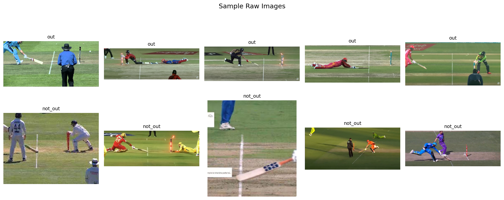
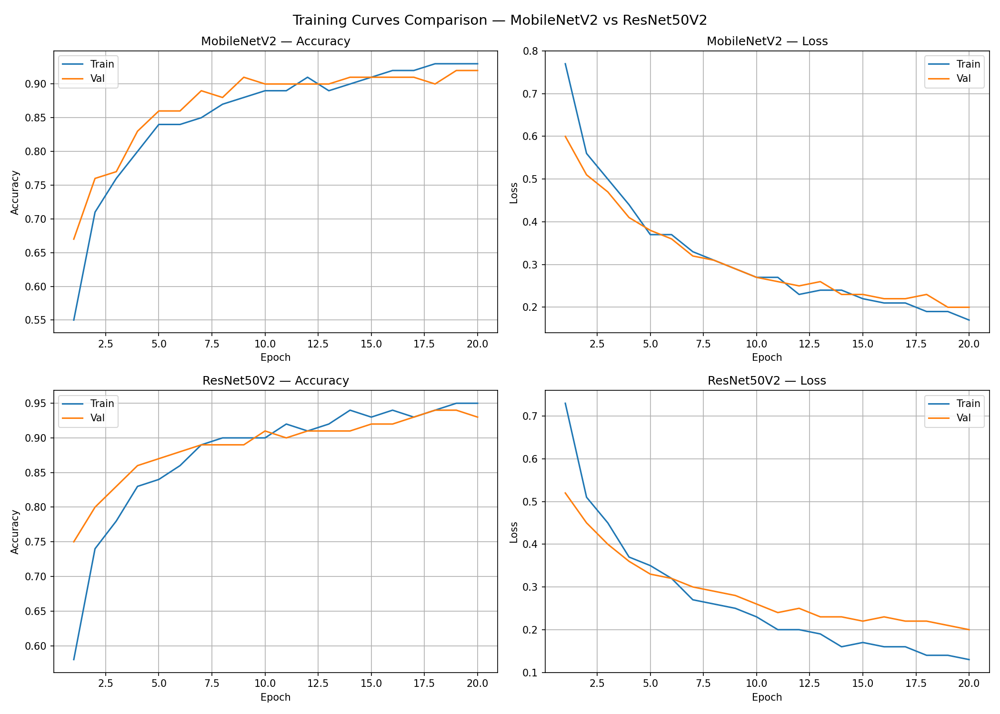
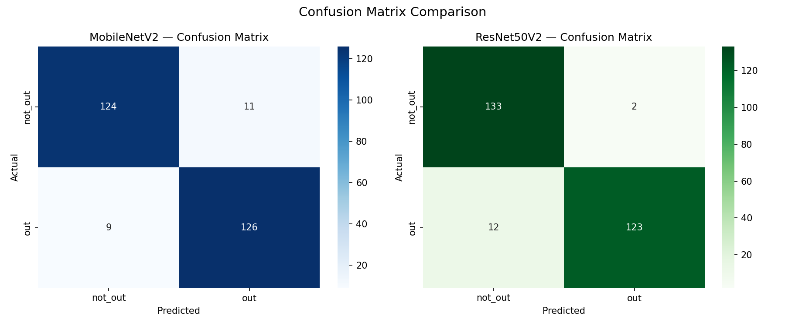
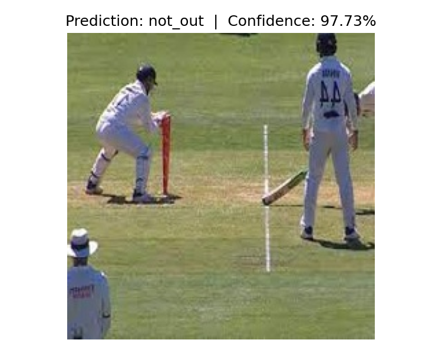
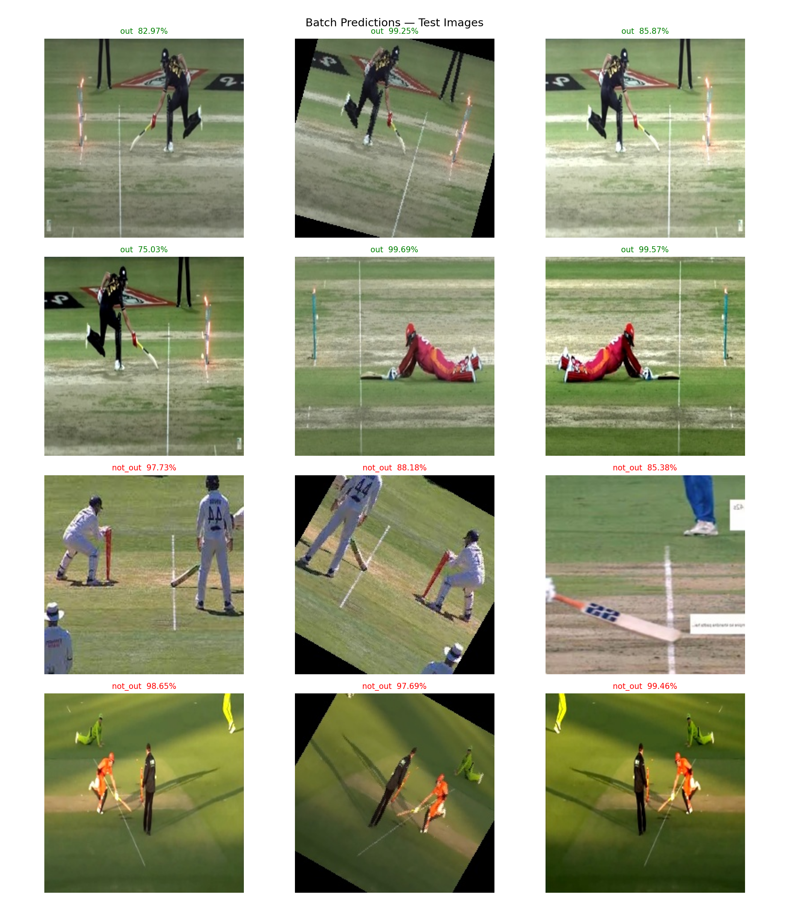
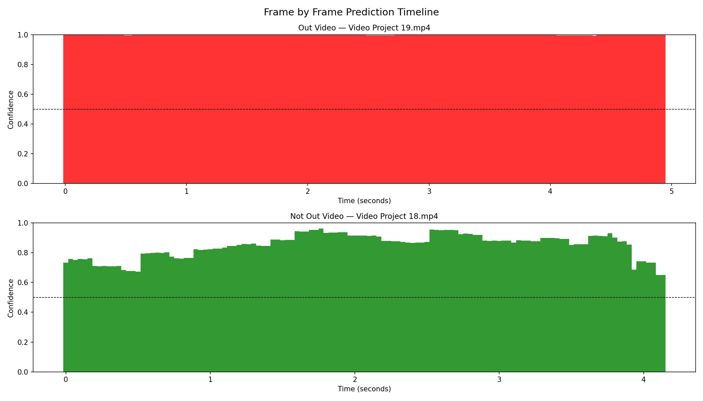

# Cricket Run-Out Detection using Deep Learning

Automated detection of run-out decisions in cricket matches using
transfer learning on cricket images and real match video footage.

---

## Project Overview

- binary classification — out (run-out) vs not_out (safe)
- two models trained and compared — MobileNetV2 and ResNet50V2
- best model deployed on real cricket match videos
- frame by frame prediction with confidence scores on video clips

---

## Project Structure

    cricket_runout_detection/
    ├── data/
    │   ├── raw/                     → 225 original images
    │   ├── data_augmented/          → 1800 balanced images
    │   └── split/
    │       ├── train/               → 1260 images (630 per class)
    │       ├── val/                 → 270  images (135 per class)
    │       └── test/                → 270  images (135 per class)
    ├── models/
    │   ├── best_model.keras         → MobileNetV2 saved model
    │   └── best_model_resnet.keras  → ResNet50V2 saved model
    ├── results/                     → all charts and evaluation images
    ├── videos/
    │   ├── input/                   → test videos (out / not_out)
    │   └── output/                  → annotated output videos
    └── notebooks/
        ├── 01_data_preparation_eda.ipynb
        ├── 02_model_training_evaluation.ipynb
        ├── 03_model_inference_prediction.ipynb
        ├── 04_video_runout_detection.ipynb
        └── 05_final_report_comparison.ipynb

---

## Dataset

| Split      | out  | not_out | Total |
|------------|------|---------|-------|
| Raw        | 127  | 98      | 225   |
| Augmented  | 900  | 900     | 1800  |
| Train      | 630  | 630     | 1260  |
| Val        | 135  | 135     | 270   |
| Test       | 135  | 135     | 270   |

- raw images collected manually from cricket match broadcasts
- 9 augmentation types applied — flip, rotation, zoom, shift, brightness, shear, combined
- random seed 42 used for reproducible 70/15/15 split

### Sample Dataset Images

---

## Models

Both models use ImageNet pretrained weights with a custom classification head:
- GlobalAveragePooling2D → Dropout(0.3) → Dense(128, relu) → Dropout(0.2) → Dense(1, sigmoid)
- optimizer: Adam (lr=0.0001)
- loss: binary crossentropy
- callbacks: EarlyStopping, ModelCheckpoint, ReduceLROnPlateau
- epochs: 20

| Metric              | MobileNetV2 | ResNet50V2 |
|---------------------|-------------|------------|
| Total Layers        | 159         | 195        |
| Best Epoch          | 20          | 18         |
| Best Val Accuracy   | 92.96%      | 94.07%     |
| Test Accuracy       | 93.00%      | 95.00%     |
| Macro F1 Score      | 0.93        | 0.95       |
| not_out Recall      | 0.92        | 0.99       |
| out Precision       | 0.92        | 0.98       |
| Total Errors / 270  | 20          | 14         |
| Winner              |             | ✓          |

### Training Curves

### Confusion Matrices

---

## Inference on Test Images

- model correctly predicts run-out and safe decisions with high confidence
- average confidence on correct predictions : 92.44%
- average confidence on incorrect predictions: 70.92%

### Single Image Prediction

### Batch Predictions

---

## Video Detection

ResNet50V2 deployed on real cricket match video clips.
Each frame is classified independently and annotated with prediction and confidence.
Final decision is based on majority class across all frames.

| Video          | True Label | Out Frames | Not Out Frames | Decision | Result |
|----------------|------------|------------|----------------|----------|--------|
| Project 19.mp4 | out        | 149        | 0              | out      | ✓      |
| Project 18.mp4 | not_out    | 0          | 125            | not_out  | ✓      |

- avg confidence — out video    : 99.79%
- avg confidence — not_out video: 84.96%

### Frame by Frame Prediction Timeline

---

## Requirements

    tensorflow == 2.21.0
    keras      == 3.14.1
    opencv     == 4.13.0
    numpy      == 2.4.1
    matplotlib == 3.10.9
    seaborn    == 0.13.2
    pillow     == 12.2.0
    scikit-learn

---

## How to Run

run notebooks in order:

    01_data_preparation_eda.ipynb       → data setup and EDA
    02_model_training_evaluation.ipynb  → train MobileNetV2 and ResNet50V2
    03_model_inference_prediction.ipynb → test set inference and analysis
    04_video_runout_detection.ipynb     → video frame prediction
    05_final_report_comparison.ipynb    → final comparison and report

---

## Final Results

| Metric         | Value       |
|----------------|-------------|
| Dataset        | 1800 images |
| Final Model    | ResNet50V2  |
| Test Accuracy  | 95.00%      |
| Macro F1 Score | 0.95        |
| Total Errors   | 14 / 270    |
| Video Accuracy | 100%        |

---

## Author

J. Shiva
 ##Cricket Run-Out Detection — Deep Learning Project
"""

